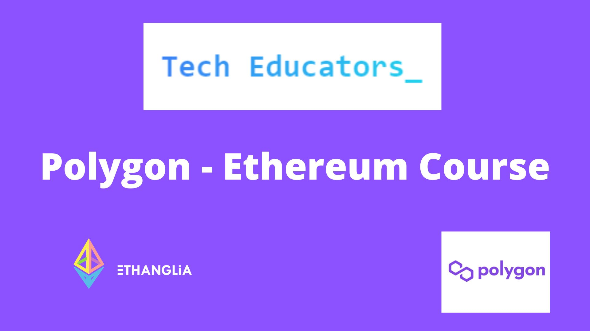

# EVM -> Polgyon Daytime course

This repo is specific to the EVM -> Polygon daytime course. 

## Pre-Requisites

The course requires a
Becoming a capable engineer cannot be taught over a period of an eight day bootcamp. The purpose of this bootcamp is to create capability that can be refined, adapted, grown and deployed over weeks, months and years. We aim to give developers a sound grounding in the technology so that they can become builders of great use cases tomorrow.

## Overview of Course Syllabus

The course is an eight day, intensive, full day bootcamp where students are expected to also complete reading, homework and consider core concepts to progress their knowledge overnight. The course is broken down into the following overview.

## Daywise Agenda

| Week | Day | Topics |
| --- | --- | --- |
| 01 | 01 | What is blockchain? → cryptography, Gossip protocol, byzantine fault tolerance, consensus protocols.How does DLT work? → creation to the addition of a block with all transactions, Merkle trees.Bitcoin whitepaper → Proof of work, mining and validation | 
| 02 | 02 | How is Ethereum different from Bitcoin? → uncle/ommer blocks, programmable chain, mempools, proof of work vs proof of stake. | 
| 01 | 03 | Why Polygon is needed? → Gas fees, Gas optimization and transaction time. | 
| 01 | 04 | Why polygon is used and how it is used? → sidechains, rollups, sharding. Existing polygon ecosystem → PoS, Hermes, Avail, Edge etc. | 
| 01 | 05 | Wallets → Custodial and non-custodial, creating your own wallet.Getting test funds from Ethereum and polygon testnets.Etherscan and polygon scan.Tokens → ERC-20, ERC-721, ERC-1155| 
| 02 | 06 | Remix and open-source IDEs.Solidity primitives → variables, functions, state mutability, visibility.Solidity intermediate → dynamic and static arrays, events and emits indexed variables. | 
| 02 | 07 | Solidity inheritance and enumeration.Solidity and smart contracts.Solidity best practices | 
| 02 | 08 | Smart contract best practices.ERC and EIP standards - 20, 1155, 165 and 721.OpenZeppelin| 
| 02 | 09 | Basics of DApps → ABI and bytecode, Infura vs Alchemy API, Moralis.The technical architecture of dApps → React js, The Graph, Hardhat, Mocha etc.Truffle vs Hardhat → Ganache, Truffle console, hardhat console etc | 
| 02 | 10 | Unit testing using chai and mocha → assertion.Pushing to git → protecting keys and other secret information| 

